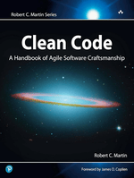

# 📚 Universal PDF Book Library


A clean and organized digital library containing PDF versions of books across multiple genres — Personal Development, Technology, Fiction, Business, Classics, QA Automation, Programming (.NET, Java, Kotlin), and more.

This repository is designed to be a valuable resource for readers, students, developers, and anyone who loves learning.

---
## 📁 Repository Structure

```
/Personal-Growth
/Programming
/QA-Automation
/Business
/Fiction
/Classics
/Technology
/Others
```

## ⭐ Purpose of This Repository

- Provide easy access to books for learning and self-improvement  
- Maintain a clean, categorized digital library  
- Share useful educational materials with the community  
- Serve as a personal knowledge archive  

---

## 📚 Included Genres

- **Personal Development** – habits, productivity, mindset  
- **Programming & Tech** – .NET, Java, Kotlin, QA Automation, DevOps  
- **Business & Finance** – entrepreneurship, investing, marketing  
- **Fiction** – sci-fi, fantasy, modern literature  
- **Classics** – timeless novels and philosophical works  
- **Other Useful Books** – psychology, creativity, history  

---

## 📚 Library Preview

---

<details>
  <summary><strong>📘 Personal Growth</strong></summary>

<br>

| Cover | Book | Author | Genre | Description | Download |
|-----|------|--------|--------|-------------|-----------|
|  | **The Power of Now** | Eckhart Tolle | Mindfulness | Discover living in the present moment | [PDF](Personal-Growth/The-Power-Of-Now-by-Eckhart-Tolle.pdf) |

</details>

---

<details>
  <summary><strong>💻 Programming</strong></summary>

<br>

| Cover | Book | Author | Genre | Description | Download |
|-----|------|--------|--------|-------------|-----------|
|  | **Clean Code** | Robert C. Martin | Programming | Best practices for writing clean software | [PDF](Programming/Clean-Code-by-Robert-C.Martin-Series.pdf) |

</details>

---

<details>
  <summary><strong>📖 QA-Automation</strong></summary>

<br>

| Cover | Book | Author | Genre | Description | Download |
|-----|------|--------|--------|-------------|-----------|
|  | **All XPath Cheats** | Me | Qa Automation | All Xpath expressions cheats sheet | [PDF](QA-Automation/XPathCheatsSheet.pdf) |

</details>


## 🚀 How to Use

1. Navigate to the genre folder  
2. Open or download any PDF you like  
3. Enjoy reading  

> ⚠️ Note: This repository is for **educational and personal use only**

---

## 👤 Author

Maintained by **Eduard Mrdoyan** — passionate about tech, learning, and sharing knowledge.

---

## ⭐ Support

If this repository helps you, please **give it a star** to support the project!


